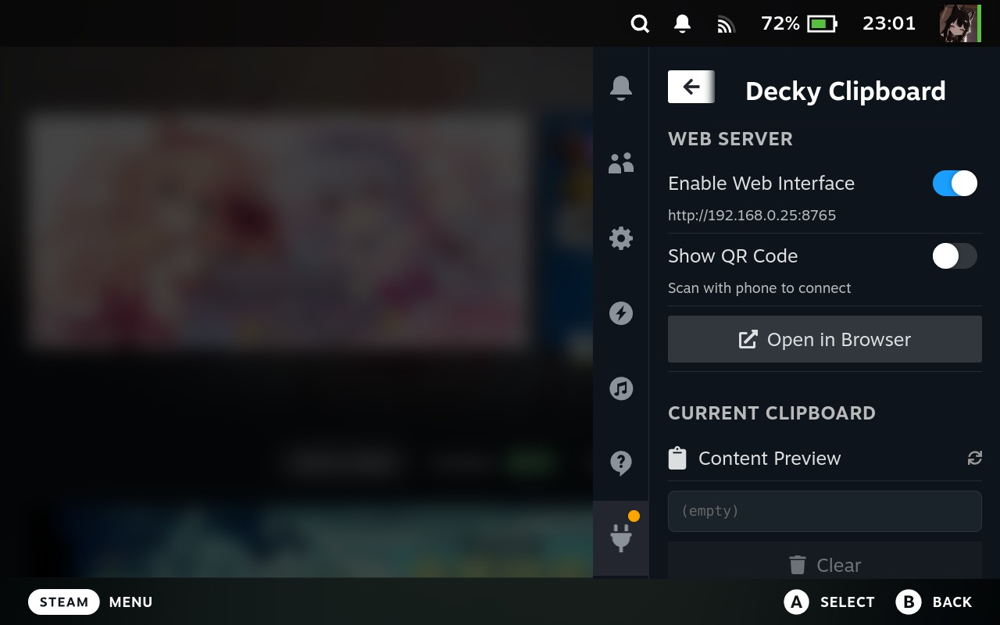
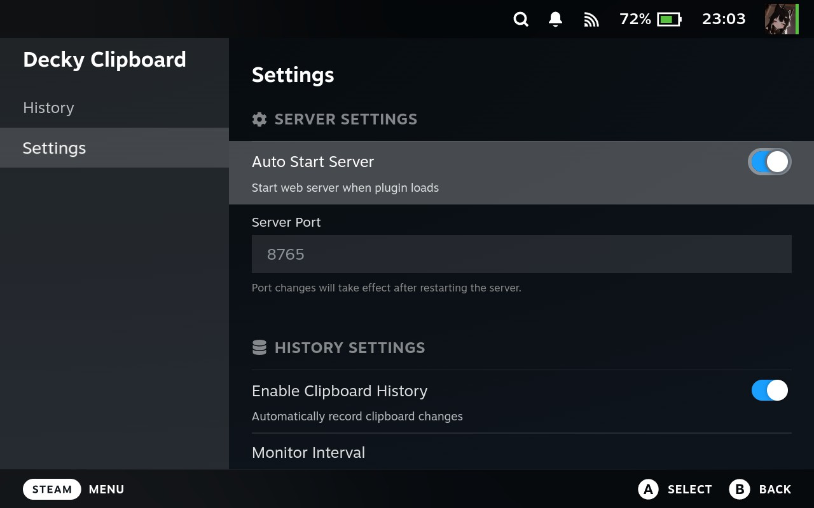
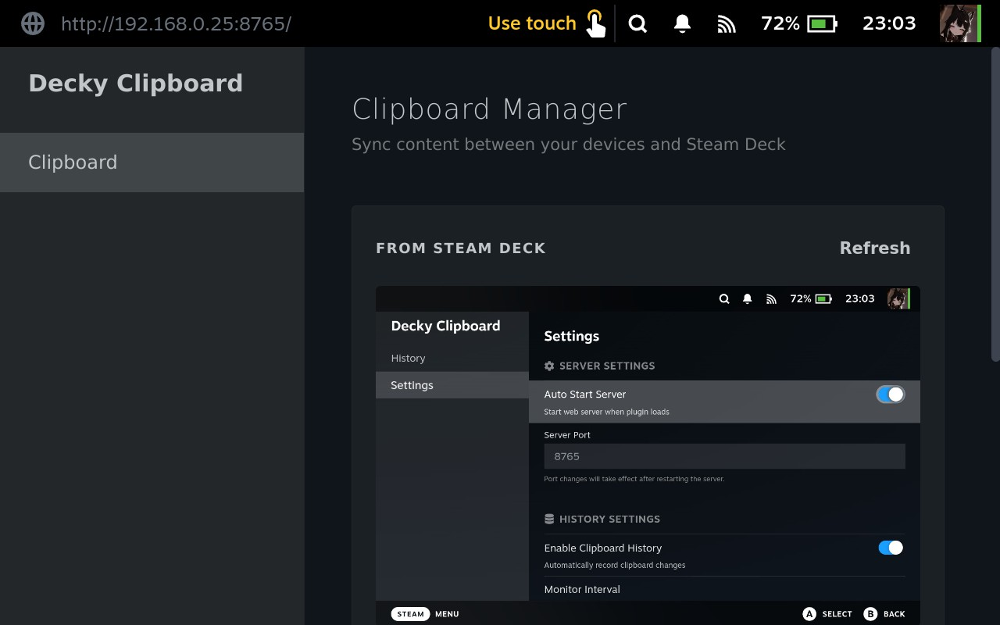

# Decky Clipboard

[English](README.md) | [简体中文](README.zh_CN.md)

一个简单的 Decky Loader 插件，通过 Web 界面与局域网内的任何设备共享 Steam Deck 的剪贴板。

## 预览

## 使用方法

1. 安装插件并打开快捷访问菜单 (`...`)。
2. 找到 **Decky Clipboard** 并记下显示的 URL（例如 `http://your-ip:8765`）。
3. 在手机或电脑上打开该 URL。
4. 开始同步！

## 技术与致谢

- **后端**: Python `aiohttp` 服务器。
- **剪贴板**: 使用捆绑的 `xclip` 二进制文件进行剪贴板操作。
- **前端**: React (Decky UI) 和原生 JS (Web 界面)。

## 许可证

本项目基于 [BSD 3-Clause License](LICENSE) 许可。

本项目捆绑了 `xclip`，该软件基于 [GPL-2.0 License](bin/LICENSE.xclip) 许可。
xclip 的源代码可以在 [https://github.com/astrand/xclip](https://github.com/astrand/xclip) 找到。

